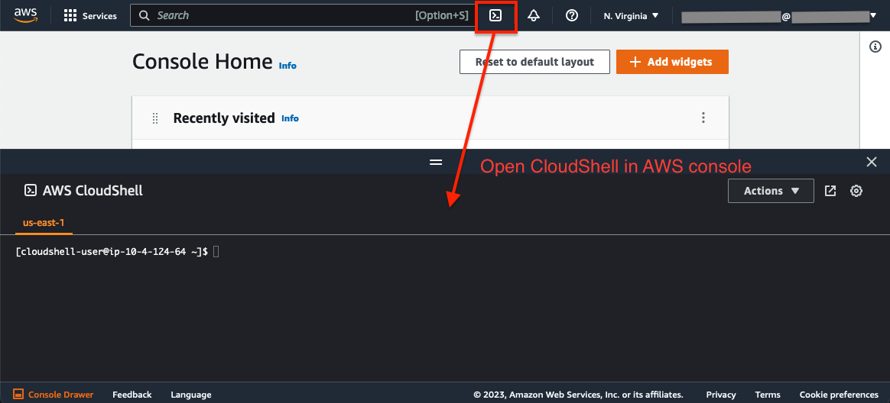

# AWS AI Content Moderation Accuracy Evaluation PoC-in-a-box (beta)

This tool will help you evaluate Amazon Rekognition image moderation's false-positive rate based on your own image dataset. Follow the instructions to deploy the system to your AWS account as a CDK package and run self-serve evaluations without privacy concerns.


To evaluate Content Moderation accuracy:

* Initiate a new task and upload your dataset to the Amazon provided S3 bucket folder.
* Start the moderation task once all the images are in place. Rekognition will then start to moderate images one by one.
* Rekognition will label some of your images as inappropriate. You then can review these images using A2I to provide human input: if the image truly has inappropriate information (true-positive) or not (false-positive).
* The tool will combine Rekognition moderation results and human inputs to produce an accuracy report.

## System architecture

The CDK package will deploy the below AWS services into your AWS account/region, including:
- A static frontend application leveraging Amazon S3, Amazon CloudFront, and Amazon Cognito.
- Serverless backend with Amazon API Gateway, AWS Lambda. Amazon DynamoDB and Amazon S3 for state management.
- Bulk processing workflow with AWS Step Functions, Amazon Rekognition and AWS Lambda functions.
- Amazon A2I for human review.


## Prerequisites
You will need admin access to the AWS account to deploy the CDK package and the underline AWS services.

### Supported AWS regions
The Accuracy Evaluation tool requires AWS services such as Amazon SageMaker GrounTruth/A2I and Amazon Rekognition, which are available in certain regions. Please choose one of the below AWS regions to deploy the CDK package.

| |Regions ||||
| ---------- | ---------- | ---------- | ---------- | ---------- |
| US | us-east-1 | us-east-2 | us-west-2 ||
| Europe | eu-central-1 | eu-west-2 | eu-west-1 ||
| Asia | ap-south-1 | ap-southeast-2 | ap-northeast-2 | ap-northeast-1 |


### Install environment dependencies and set up authentication
<details><summary>
:bulb: You can skip this section if using CloudShell to deploy the CDK package or the other AWS services support bash command from the same AWS account (ex. Cloud9). This section is required if you run from a self-managed environment such as a local desktop.
</summary>

- [ ] Install Node.js
https://nodejs.org/en/download/

- [ ] Install Python 3.7+
https://www.python.org/downloads/

- [ ] Install Git
https://github.com/git-guides/install-git

- [ ] Install Pip
```sh
python -m ensurepip --upgrade
```

- [ ] Install Python Virtual Environment
```sh
pip install virtualenv
```


- [ ] Setup the AWS CLI authentication
```sh
aws configure                                                                     
 ```                      
</details>




### Deploy the CDK package
> :warning: **Set up a SageMaker GroundTruth private team via the AWS console**: 
Before starting the CDK deployment, you must manually set up SageMaker GrounTruth private team in the AWS console if the account/region doesn't have it provisioned.
Follow this [instruction](set-up-work-team.md) 
to set up the private team. This step will create the user(s) to access the Accuracy Evaluation web portal and A2I for human review.

Once set up the SageMaker GrounTruth private team, follow the below steps to deploy the CDK package.

1. Clone code
```sh
git clone https://github.com/lanazhang/aws-ai-cm-rek-img-accuracy-eval-cdk.git
```
```sh
cd aws-ai-cm-rek-img-accuracy-eval-cdk/
```

2. Install Node CDK package
```sh
sudo npm install -g aws-cdk
```

3. Create Python Virtual Environment
```sh
python3 -m venv .venv
```

4. Activate virtual environment

  - On MacOS or Linux
  ```sh
  source .venv/bin/activate
  ```
  - On Windows
  ```sh
    .venv\Scripts\activate.bat                                        
```

5. Once the virtualenv is activated, you can install the required dependencies.

```
pip install -r requirements.txt
```

6. Set up environment varaibles - change the values to your target AWS account Id and region.
```
export CDK_DEFAULT_ACCOUNT=[YOUR_ACCOUNT_ID]
export CDK_DEFAULT_REGION=[YOUR_TARGET_REGION]
```

7. Bootstrap CDK - this step will launch a CloudFormation stack to provision the CDK package, which will take ~2 minutes.
```
cdk bootstrap aws://${CDK_DEFAULT_ACCOUNT}/${CDK_DEFAULT_REGION}
```

8. Deploy CDK package - this step will launch one CloudFormation stack with three nested stacks for different sub-systems, which will take ~10 minutes.
```
cdk deploy --all --requires-approval never
```

Once the deployment completes, you can find the website URL in the bash console. You can also find it in the CloudFormation console by checking the output in stack **cm-accuracy-eval-RootStack**.

Use the username/password set up earlier in the GroundTruth private team stage to log in to the website.


## Add new users
You can log in to the Accuracy Evaluation web portal using the user created in the step: **Set up a SageMaker GroundTruth private team using the AWS console**. The same username/password will work for both the web portal and the A2I human review console.

To add additional users to the system using the AWS console:
- Navigate to SageMaker
- Select GroundTruth -> Labeling workforces on the left menu
- Choose the "Private" tab
- Click on "Invite new workers" at the bottom "Workers" section and add new users by specifying email addresses. The system will send an invite Email(s) to the users automatically.
- Add the new user(s) to the work team:
  - Click on the team name in the "Private team" section
  - Click on the "Workers" tab to see all the workers in the pool
  - Select the worker and click on the "Add workers to team" button