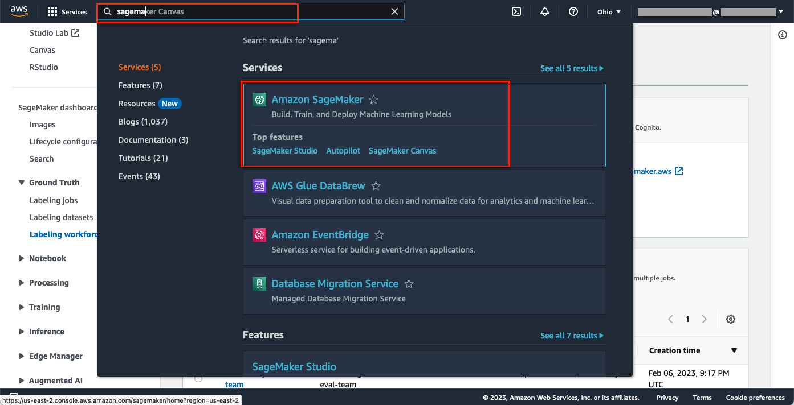
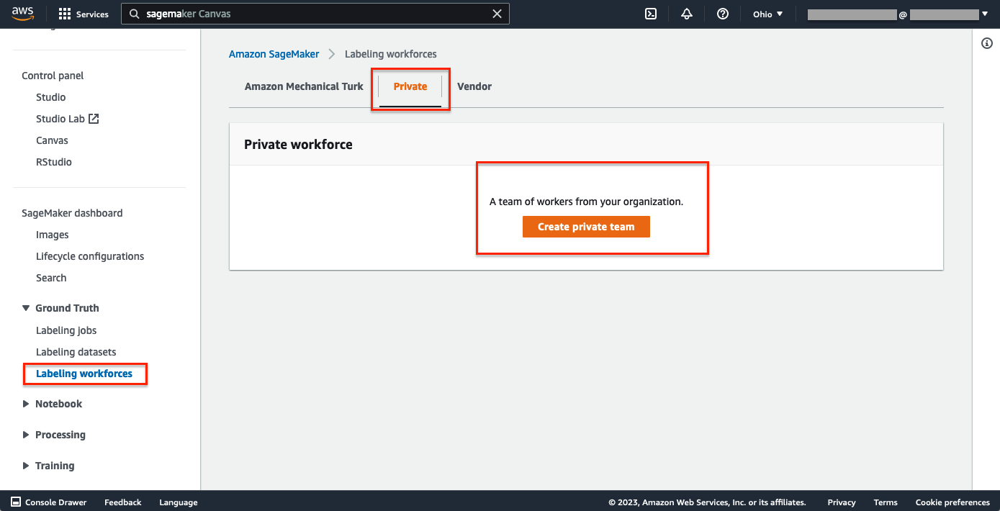
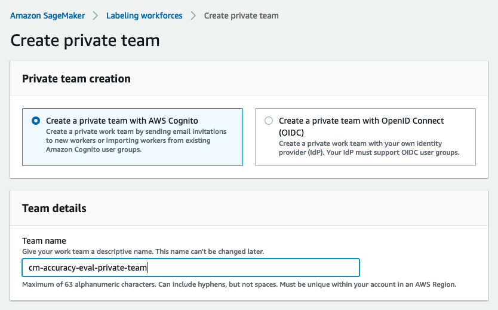
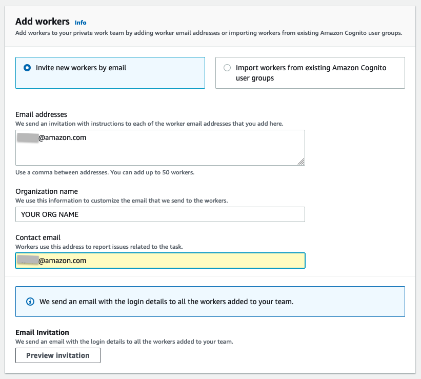
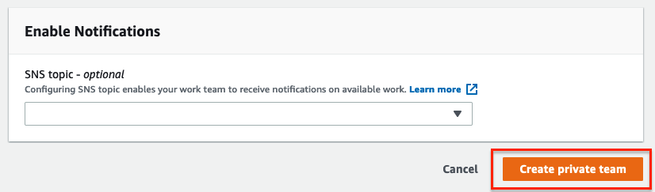

# Set up work team in the AWS console

In the AWS console, navigate to SageMaker by typing "sagemaker" in the search bar and selecting "Amazon SageMaker" in the drop-down list.

In the Amazon SageMaker Console, click on the **Labeling Workforces** option under Ground Truth in the left panel. Then under the **Private** tab, click the **Create private team** button.

Provide a name as the Team name (example: cm-accuray-eval-private-team)

In the Email addresses, type in the user Email(s) that should have access to the A2I console. You can start with your own Email address for testing and come back to add more Emails when needed.

Provide an Organization name. (example: YOUR ORGANAZATION NAME).

Provide a contact email. (example: your Email address)

You can create an SNS topic for the workforce. So A2I will send the reviewer (specified in the Email Addresses section) an Email when a new moderation task assigns to them. 
This setting is optional. No Email will be sent to the reviewer for a new task if you don't create the SNS topic in this step.

Click on "Create Private Team". AWS will launch all the underline services, including deploying the A2I web portal, launching an AWS Cognito user pool, and creating an SNS topic if specified. This step will take ~ one minute to complete.

In a few minutes, you should receive an email like the screenshot below. It contains:

- The URL to the A2I reviewer console.

- User name: the Email address you specified in the previous step in the Email addresses section.

- A temperate password.

You can then follow the instruction to activate the account by specifying a permanent password.
